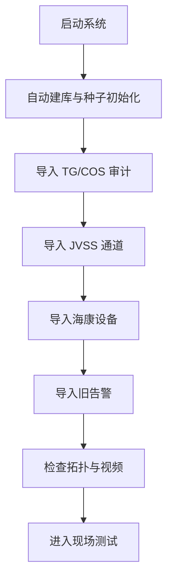

# 永嘉集团信息弱电视频运维系统 V2 数据初始化指南

> 这份文档说明“系统刚装好时，数据从哪里来、按什么顺序导入、哪些数据是自动生成的、哪些需要你手工准备”。

## 1. 两类数据先分清

### 1.1 系统自动初始化的数据

系统启动时会自动创建数据库，并写入一批“种子数据”：

- 默认管理员、值班主管、现场维修员
- 默认控制平台占位记录
- 默认智能体接口占位记录
- 默认移动端通道占位记录
- 默认存储提供方占位记录
- 默认通知通道占位记录
- 部分默认工单、巡检任务

这些数据的作用是让系统能立刻登录、能看页面、能跑流程。

### 1.2 现场真实业务数据

下面这些必须靠你现有平台导出或人工整理后再导入：

- TG/COS 平台导出的摄像头-交换机-端口关系
- TG/COS 的面积/楼层/区域关系
- TG/COS Telnet L2 MAC 表或 VLAN 表
- JVSS 平台导出的通道关系
- 海康 NVR / 解码器导出的通道与设备关系
- 旧系统告警
- 风控/电控平台的只读审计结果
- 楼层 CAD 图纸映射信息

## 2. 启动后会自动发生什么

系统启动时会自动执行：

1. 创建数据库文件
2. 创建表结构
3. 检查并补齐缺失字段
4. 自动写入种子数据
5. 读取已存在的运行数据

也就是说，**你不需要手工先建表**，只要把系统启动起来即可。

## 3. 如果你想“清空后重建”

这通常在下面几种场景出现：

- 开发验证阶段，想从零开始
- 数据导入重复太多，想重新整理
- 新服务器正式上线前，想切换到干净库

### 推荐步骤

1. 停止系统。
2. 备份当前数据库和 runtime 目录。
3. 删除或改名 `runtime/platform_v2.db`。
4. 如果需要，也清空 `runtime/alert_guard_settings.json` 和临时缓存。
5. 重启系统。
6. 系统会自动重新创建数据库并写入种子数据。
7. 然后再按导入顺序导入现场真实数据。

### 注意

- 不要直接删备份目录。
- 如果你要保留历史告警和工单，就不要删除现有数据库。
- 如果只是想重新导入设备关系，通常不必删全部库，可以只删对应导入结果，再重跑导入。

## 4. 真实数据导入顺序

建议按下面顺序导入，效果最好：

1. 控制平台事实来源
2. TG/COS 摄像头与交换机映射
3. TG/COS 区域和楼层映射
4. TG/COS VLAN / L2 MAC 回填
5. JVSS 通道关系
6. 海康 NVR / 解码器通道关系
7. 旧系统告警
8. 控制平台占位数据升级为真实接入数据

这个顺序的原因是：

- 先有平台和设备主干，后续导入才能对上
- 先有交换机和 VLAN，摄像头归属才能更准确
- 先有区域和楼层，告警归属和地图才有意义

## 5. 可用的导入入口

### 5.1 导入已知审计数据

系统提供一键导入已知审计结果：

```http
POST /api/setup/import-known-audits
```

它会自动尝试导入已经放在 `docs/switch-audit/` 下的审计资料。

### 5.2 单项导入

你也可以按来源逐个导入：

- `POST /api/setup/import-source/jvss-main`
- `POST /api/setup/import-source/jvss-stream`
- `POST /api/setup/import-source/tg-cos`
- `POST /api/setup/import-source/tg-cos-area`
- `POST /api/setup/import-source/tg-cos-vlan`
- `POST /api/setup/import-source/legacy-alerts`
- `POST /api/setup/import-source/control-platform-new`
- `POST /api/setup/import-source/control-platform-legacy`

海康审计数据则按 IP 组织，例如：

- `POST /api/setup/import-source/hikvision-192.168.1.2`
- `POST /api/setup/import-source/hikvision-192.168.1.3`
- `POST /api/setup/import-source/hikvision-192.168.5.253`

## 6. 需要提前准备哪些文件

### 6.1 TG/COS 平台

建议准备：

- 摄像头到交换机端口的导出表
- 摄像头区域/楼层导出表
- Telnet 设备输出包
- L2 MAC / VLAN 输出

建议放在：

- `docs/switch-audit/10.0.68.250-audit/`

### 6.2 JVSS 平台

建议准备：

- `extracted_channels.csv`
- 通道名、摄像头 IP、RTSP 地址

建议放在：

- `docs/switch-audit/10.0.59.200-audit/`
- `docs/switch-audit/10.0.59.205-audit/`

### 6.3 海康设备

建议准备：

- NVR 导出的通道信息
- 设备 IP 列表
- 账号密码
- RTSP 地址

建议放在：

- `docs/switch-audit/hikvision-audit-20260409/`

## 7. 如何判断导入是否成功

导入成功后，至少要看到下面几件事：

- 设备管理里出现新增设备
- 拓扑页有链路关系
- 视频中心有通道
- 告警中心能按设备归属显示
- 控制平台页能看到注册记录
- 运行中心能看见数据库和服务状态

## 8. 导入时的几个常见策略

### 8.1 按 IP 匹配更新

适合：

- 设备 IP 稳定
- 平台里已经有 IP
- 你想补全字段而不是新建重复设备

### 8.2 替换并合并

适合：

- 同一摄像头在多个平台中出现
- 名称不一致，但 IP 一样
- 需要把多个来源统一到一个实体上

### 8.3 条件插入部分字段

适合：

- 表格里只有 IP、名称、区域中的一部分
- 想让系统自动补全其他字段

### 8.4 只读导入

适合：

- 第三方平台
- 风控/电控平台
- 你不想改源系统，只想把事实拿回来

## 9. 初始化后建议做的第一轮检查

1. 打开首页，确认服务健康。
2. 打开设备管理，确认设备数量是否合理。
3. 打开告警中心，确认历史告警是否导入。
4. 打开视频中心，确认通道是否可预览。
5. 打开控制平台，确认平台注册记录是否存在。
6. 打开拓扑页，确认交换机-摄像头链路。
7. 打开运行中心，确认数据库与服务状态。

## 10. 数据初始化推荐节奏

### 第一阶段

- 只导入核心事实源
- 先打通摄像头、交换机、平台、告警

### 第二阶段

- 再导入区域、楼层、CAD 关联
- 补拓扑

### 第三阶段

- 再导入巡检、工单、通知、移动端
- 开始正式使用

### 第四阶段

- 再接智能体、模型、存储、外部平台
- 逐步替代第三方系统

## 11. 推荐的“从零上线”操作模板



## 12. 如果你要完全重新开始

如果你准备做“干净库重新上线”，建议这样做：

1. 备份当前数据库。
2. 删除旧数据库。
3. 启动系统。
4. 确认种子数据已自动生成。
5. 按顺序导入 TG/COS、JVSS、海康、旧告警。
6. 再做真实设备巡检。

## 13. 说明

当前系统已经具备“先自动起壳，再逐步导入真实数据”的能力。  
如果现场没有数据，系统也能先跑；但真正能投入使用，必须尽快导入真实平台数据和设备关系。

